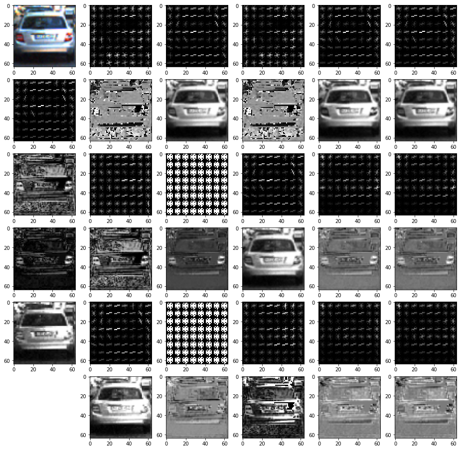
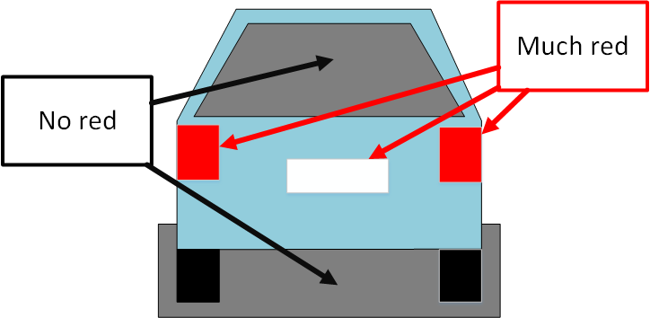
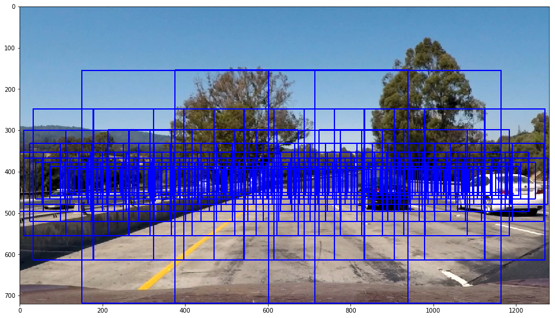
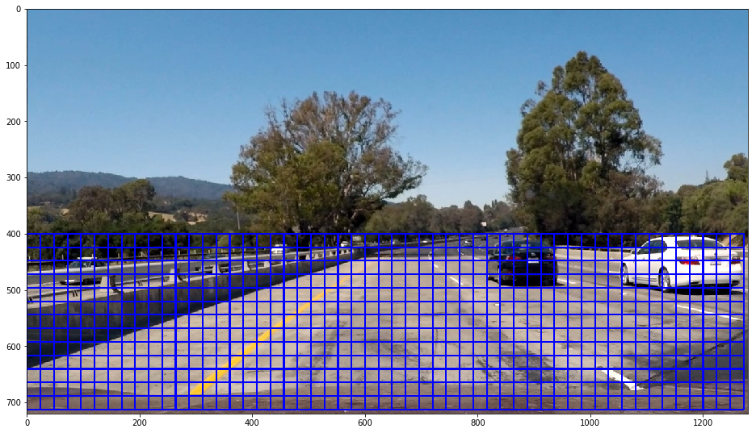
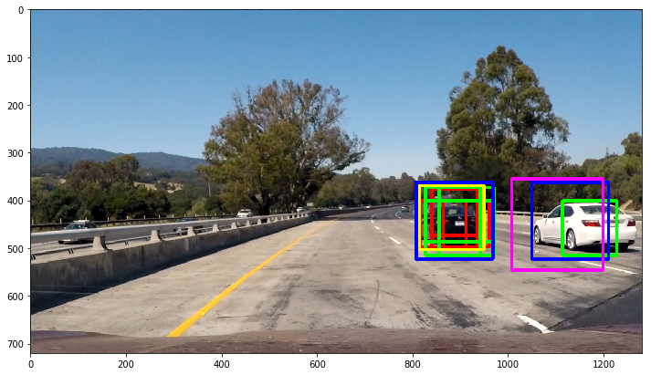
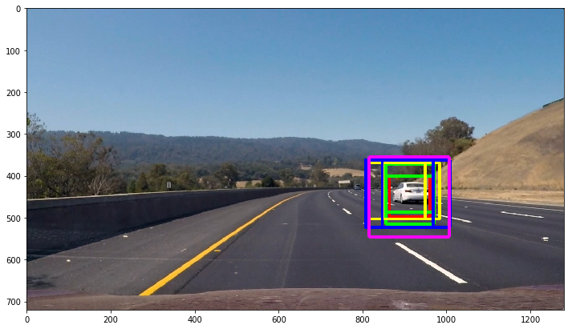

## Writeup Template
### You can use this file as a template for your writeup if you want to submit it as a markdown file, but feel free to use some other method and submit a pdf if you prefer.

---

## Vehicle Detection Project ##

The goals / steps of this project are the following:

* Perform a Histogram of Oriented Gradients (HOG) feature extraction on a labeled training set of images and train a classifier Linear SVM classifier
* Optionally, you can also apply a color transform and append binned color features, as well as histograms of color, to your HOG feature vector. 
* Note: for those first two steps don't forget to normalize your features and randomize a selection for training and testing.
* Implement a sliding-window technique and use your trained classifier to search for vehicles in images.
* Run your pipeline on a video stream (start with the test_video.mp4 and later implement on full project_video.mp4) and create a heat map of recurring detections frame by frame to reject outliers and follow detected vehicles.
* Estimate a bounding box for vehicles detected.


## 1. Prepare data ##

Code: prepare-data.ipynb

In the first step I prepare a training dataset with list cars and non-cars images. Source files are stored in nested folders, but I prefer to work with plain lists of files. My code traverses recursively folders with images and places PNG files in either ./data/cars or ./data/non-cars folders. Files in different source folder can have same name, so I implemented simple logic to generate unique names by adding suffix if the target file already exists.

To get bigger dataset form every source file I also generate second image flipping it horizontaly.

That provided me 17584 car images and 17936 non-car images.

## 2. Data exploration ##

Source code: data_exploration.ipynb

To find the best color space for feature extraction I tried to convert source images in different color spaces.



### 2.1 Histogram of Oriented Gradient (HOG) ### 

Every channel with high contrast is Ok for HOG feature extraction.  Grayscale, V of HSV, L of LUV, L of HLS, Y of YUV, Y of YCrCb all produce approximately the same result.

### 2.2 Color Histogram Features ###

RGB channels all contain information about colors and calculating histograms in RGB should be Ok.

### 2.3 Spatial features. ###

Cars can look very different, so simple template matching is not efficient. I decided to analyze the R channel from RGB hoping it will help to exclude images that are not cars.

Almost every car in red channel has light pixels on rear lights and license plate. It also has dark pixels on rar window and in the shadow below the car. If image does not have these features it's probably not a car.



It's also possible to find such invariants in other color channels, so after some experiments I decided to include all RGB channels in the spatial features.  High resolution is unnecessary and I scale it down to 16x16 pixels. 

### 2.4 Color-based search ###

Car can usually be described as "rectangular object about all having the same color". I tried to search for patterns in color channel, but that does not work well. Colors in the training images are very distorted by compression artifacts.

### 2.5 Color variance search ###

I also tried to search for images with low deviation in hue color channel because cars are normally painted in one color and most pixels are expected to have similar hue values. That also was not successful.

### 2.6 Summary ###

I am going to extract HOG features from the highly contrast Y channel. Additionally I am going to use red channel for spatial features.

## 3 Parameters ##

I created helper class MyParameters that encapsulates all parameters needed for feature extraction. That makes function calls smaller because I can pass all settings as a single object.

 ```python
parameters = MyParameters(
    hog_color_space = 'YCrCb',
    orient=11,
    pix_per_cell=8, 
    cell_per_block=2, 
    hog_channel='0',
    spatial_size=(16, 16),
    spatial_color_space='RGB', 
    spatial_color_channel='ALL',
    nbins=16, 
    bins_range=(0, 256),
    spatial_feat=True, 
    hist_feat=True, 
    hog_feat=True
)  
```

 ### 3.1. Feature extraction ###
 
 The main jobs does the function extract_features_single that takes a single image as numpy array and a parameters object and returns feature vector. Starting with example from the course I modified the function to support different color spaces for gradient and spatial/histogram features.
 
 ## 4. Train the classifier ##
 
 To train the model I extract features from PNG files, normalize data with the StandardScaler and then train SVC classifier.
 
 To find the best combination of kernel type and C parameter I use GridSearchCV function that tries all possible combinations of parameters. I found kernel = rbf with C = 3 be the most accurate combination.
 
 The learned data of StandardScaler and Classifier are then stored in the file system for future use. Finding the best parameter combination takes up to 20 minutes and I do not want to do it every time I run the Notebook.
 
 The classifier is measured on validation dataset (20% of all data) and shows accuracy > 98%.
 
 ## 5. Implement a sliding-window technique ##
 
 Here I tried two completely different approaches to place detection windows.
 
 ### 5.1 Perspective-based windows ###
 
 In the previous project I learned how to do perspective transformation from the car camera image into the bird-eye view.  The function generate_windows places windows on the road in a rectangular grid and then use inverse transformation to map the back into image coordinates. The advantage of this approach is that the parameters have real world meaning like lane width and length in meters. To compensate possible road turns my grid has trapezoid form with the far side being 15 meters wider in left and right directions. That corresponds curve radius of about 250 meters.
 
The resulting window mesh looks like the following:



### 5.2 Sliding windows ###

Another approach is to use sliding windows with fixed step in the bottom part of the image. That requires some trial and error to find suitable size parameters. 



## 6. Hog Sub-sampling Window Search ##

To improve the performance it's recommended to calculate gradients once for every group of windows having same size and the just subsample that data in every window. That is implemented in the function find_cars that uses sliding windows technique.

Window sizes are controlled by the scale parameter. For scale values I use geometric progression from 1.5 to 5 in 5 steps. See function calculate_scales.

To test how different windows sizes work I painted them in different colors on test images.   





## 7. Heat map ##

The technique described above usually finds several matches for the same car, but also can report false positives. To filter out the noise I use heat map that increase the weight of every pixel if it belongs to some window. Islands with the highest weights are then labeled as cars.

  

## 8. Video pipeline ##

Finally I create video with moviepy.editor library as I already did in other projects. Calculating one frame takes about 2 seconds, so I first tested the video pipeline on a short test video.

Test video: test_video_output.mp4

Project video: project_video_output.mp4

 
## Discussion

Support vector machine classifieres are very easy to understand and use, but they get very slow on long feature vectors. I think convolution neural network will be much more efficient.

There is also much improvement potential in filtering and extrapolation results of sequential video frame. For example I could imagine that Kalman filter will be more efficient for tracking cars and predicting their speed and driving direction.
  
   
